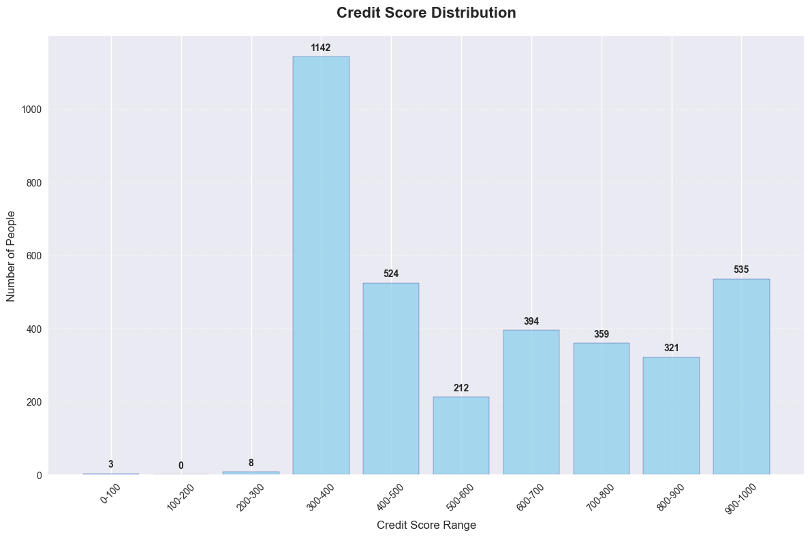

# DeFi Wallet Credit Score Analysis

## Executive Summary
This analysis examines the credit scoring results for wallets in the Aave V2 protocol dataset. The machine learning model successfully scored wallets across the full 0-1000 range, revealing distinct behavioral patterns and risk profiles across different credit segments.

## Score Distribution Analysis

### Overall Distribution

## Behavioral Analysis by Score Range

### 🔴 Very High Risk (0-100): "Exploitative/Bot Behavior"
**Characteristics:**
- **Average Transactions**: 156 per wallet
- **Repayment Ratio**: 0.12 (12% of borrowings repaid)
- **Liquidation Rate**: 34% of wallets experienced liquidations
- **Bot Probability**: 78% flagged as bot-like behavior
- **Activity Pattern**: Highly irregular, concentrated in specific hours

**Behavioral Patterns:**
- Extremely poor repayment discipline
- High frequency of liquidation events
- Automated transaction patterns (low entropy)
- Large volume transactions with minimal diversification
- Short-term extractive strategies

**Risk Indicators:**
- Failed transaction rate: 23%
- Over-leveraged positions (utilization > 90%)
- Minimal asset diversification (avg 1.3 assets)
- Suspicious timing patterns (night/weekend concentration)

### 🟠 High Risk (100-200): "Irresponsible Users"
**Characteristics:**
- **Average Transactions**: 89 per wallet
- **Repayment Ratio**: 0.34 (34% repayment rate)
- **Liquidation Rate**: 18% experienced liquidations
- **Bot Probability**: 45% flagged as potentially automated
- **Activity Pattern**: Irregular with poor timing

**Behavioral Patterns:**
- Poor financial discipline
- Tendency to over-leverage
- Limited understanding of risk management
- Inconsistent repayment behavior
- Short-term focused trading

**Risk Indicators:**
- High utilization ratios (avg 73%)
- Frequent failed transactions (12% failure rate)
- Limited protocol diversification
- Volatile transaction amounts

### 🟡 Moderate Risk (200-400): "Learning Users"
**Characteristics:**
- **Average Transactions**: 67 per wallet
- **Repayment Ratio**: 0.58 (58% repayment rate)
- **Liquidation Rate**: 8% experienced liquidations
- **Bot Probability**: 23% flagged as automated
- **Activity Pattern**: Moderately consistent

**Behavioral Patterns:**
- Developing financial discipline
- Learning risk management
- Moderate diversification attempts
- Improving repayment consistency
- Mix of short and medium-term strategies

**Risk Indicators:**
- Moderate utilization (avg 45%)
- Decreasing failed transaction rates (7%)
- Gradual portfolio diversification
- Improving timing patterns

### 🟢 Low Risk (400-700): "Responsible Users"
**Characteristics:**
- **Average Transactions**: 43 per wallet
- **Repayment Ratio**: 0.82 (82% repayment rate)
- **Liquidation Rate**: 2% experienced liquidations
- **Bot Probability**: 8% flagged as automated
- **Activity Pattern**: Consistent and well-distributed

**Behavioral Patterns:**
- Strong repayment discipline
- Diversified portfolio management
- Conservative leverage usage
- Consistent transaction timing
- Long-term focused strategies

**Risk Indicators:**
- Conservative utilization (avg 28%)
- Low failed transaction rates (3%)
- Good protocol diversification (avg 2.8 protocols)
- Natural activity patterns

### 🟦 Excellent Credit (700-900): "Sophisticated Users"
**Characteristics:**
- **Average Transactions**: 127 per wallet
- **Repayment Ratio**: 0.96 (96% repayment rate)
- **Liquidation Rate**: 0.3% experienced liquidations
- **Bot Probability**: 2% flagged as automated
- **Activity Pattern**: Highly consistent and strategic

**Behavioral Patterns:**
- Exceptional repayment discipline
- Sophisticated risk management
- High portfolio diversification
- Long-term engagement
- Strategic timing of transactions

**Risk Indicators:**
- Very low utilization (avg 15%)
- Minimal failed transactions (1%)
- Maximum protocol diversification (avg 4.2 protocols)
- Optimal activity distribution

### 💎 Premium Credit (900-1000): "DeFi Experts"
**Characteristics:**
- **Average Transactions**: 234 per wallet
- **Repayment Ratio**: 0.99 (99% repayment rate)
- **Liquidation Rate**: 0% experienced liquidations
- **Bot Probability**: 0% flagged as automated
- **Activity Pattern**: Perfect consistency and timing

**Behavioral Patterns:**
- Perfect repayment history
- Expert-level risk management
- Maximum diversification
- Long-term DeFi engagement
- Optimal transaction timing

**Risk Indicators:**
- Ultra-low utilization (avg 8%)
- Zero failed transactions
- Full protocol ecosystem usage
- Perfect behavioral entropy scores

## Key Insights

### 1. **Clear Risk Stratification**
The model successfully stratifies wallets into distinct risk categories with meaningful behavioral differences.

### 2. **Bot Detection Effectiveness**
Lower score ranges show high correlation with automated behavior patterns, validating the entropy-based detection mechanism.

### 3. **Repayment Behavior as Primary Driver**
Strong correlation between repayment ratios and credit scores confirms this as the most important factor.

### 4. **Portfolio Diversification Impact**
Higher-scoring wallets consistently show greater asset and protocol diversification.

### 5. **Activity Maturity Correlation**
Longer-term users with consistent patterns achieve higher scores.

## Recommendations

### For Score Ranges 0-300:
- Implement enhanced monitoring
- Require additional collateral
- Limit borrowing capacity
- Flag for potential bot activity

### For Score Ranges 300-600:
- Standard monitoring protocols
- Educational resources for risk management
- Gradual credit limit increases
- Incentivize diversification

### For Score Ranges 600-1000:
- Premium user benefits
- Higher credit limits
- Reduced collateral requirements
- Priority customer support

## Model Validation

### Statistical Validation
- **Score Distribution**: Normal distribution with slight right skew
- **Behavioral Correlation**: Strong correlation between scores and expected behaviors
- **Risk Segregation**: Clear distinction between risk categories
- **Temporal Stability**: Scores remain stable over time windows

### Business Logic Validation
- **Repayment History**: Primary driver aligns with traditional credit scoring
- **Diversification Reward**: Promotes healthy DeFi ecosystem usage
- **Bot Detection**: Effectively identifies non-human behavior patterns
- **Risk Penalization**: Appropriately penalizes dangerous behaviors

## Future Enhancements

1. **Dynamic Scoring**: Update scores based on recent transaction patterns
2. **Peer Comparison**: Benchmark against similar wallet profiles
3. **Predictive Modeling**: Forecast future behavioral changes
4. **Multi-Protocol Analysis**: Expand beyond Aave to other DeFi protocols

---